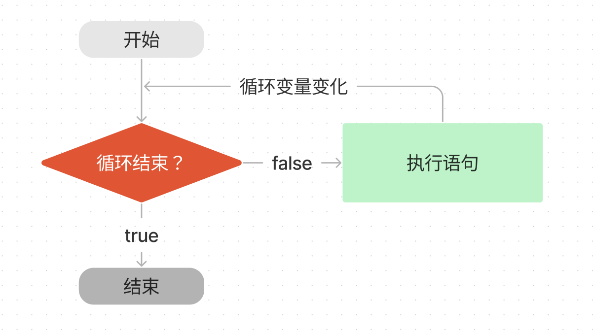
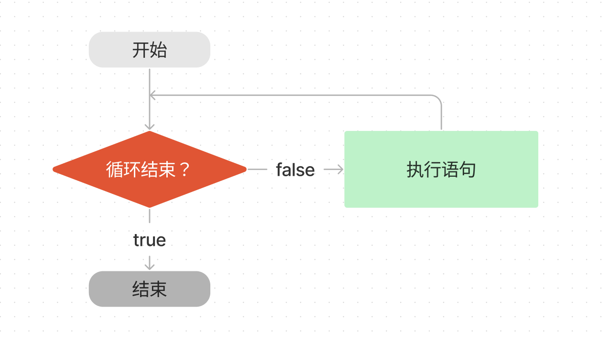
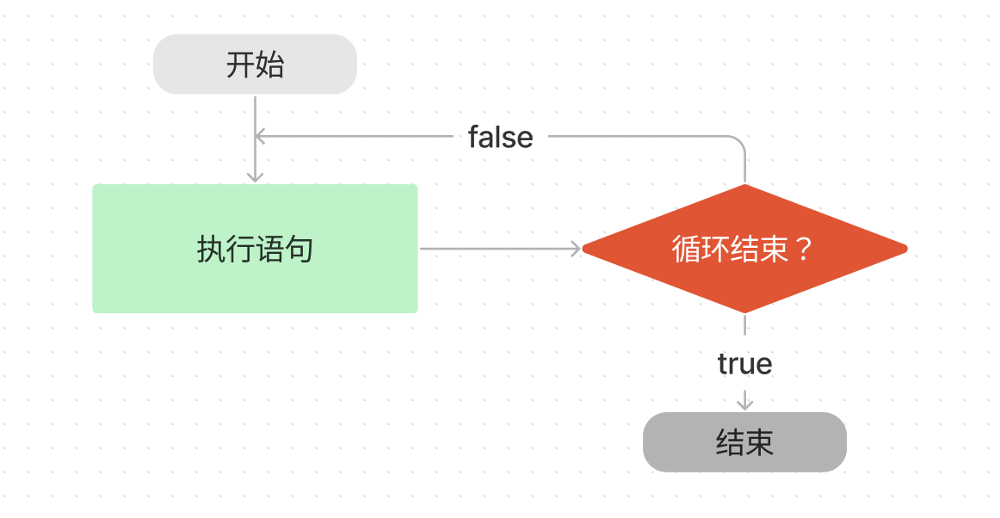

# JavaScript 极简教程: 7. 循环语句

我们经常需要重复执行一些操作，比如将列表中的商品逐个输出。这一讲，我们将介绍 JavaScript 中的循环语句，让程序重复执行某些操作。


## for 循环



`for` 循环是最常使用的循环形式，它可以指定循环的起点、终点和终止条件。其基本结构如下：

```js
for (循环变量初始化; 循环结束条件; 增量表达式) {
  执行语句
}
```

其中

- 循环变量初始化：初始化循环计数器，比如我们初始化一个变量来记录循环次数 `let i = 0`。
- 循环结束条件：它是一个表达式，用于判断是否结束循环。每轮循环开始时，都会计算这个条件表达式的值，若为 `true`，才继续进行循环；否则停止循环。比如，我们循环十次，即 `i < 10`。
- 增量表达式：每轮循环执行的最后一个操作，通常用来更新循环变量。一般会将循环变量加一 `i++`。
- 执行语句: 每次循环重复的动作。比如打印出当前 `i` 的值。

下面是循环打印 `i` 的代码：

```js
for (let i = 0; i < 10; i++) {
  console.log(`i 当前的值为：${i}`);
}

// i 当前的值为：0
// i 当前的值为：1
// ...
// i 当前的值为：9
```


## while 循环



`while` 语句包括一个循环条件和一段代码块，每次循环会先检查循环条件，若为 `ture`，就继续执行代码块。它的基本结构如下：

```js
while (条件) {
  语句
}
```

与 `for` 循环相比，它没有循环变量及其自增，需要在语句中自己定义。我们将上面的例子改写为 `while` 循环：

```js
let i = 0
while (i < 10) {
  console.log(`i 当前的值为：${i}`);
  i++;
}
```

## do-while 循环



`do-while` 循环与 `while` 循环类似，唯一的不同在于`do-while`  循环会首先执行循环体，然后检查条件，当条件为 `true`，重复执行循环体。其基本结构如下：

```js
do {
  语句
} while (条件)
```

这种结构的特点是不管条件是否为真，循环体至少执行一次。将前面 `while` 循环中打印 `i` 的例子改成 `do-while` 循环如下：

```js
let i = 0
do {
  console.log(`i 当前的值为：${i}`);
  i++;
} while (i < 9)
```

> 思考一下为什么这里的条件是 `i < 9` 而不是 `i < 10`？如果改为 `i < 10`，结果会有什么变化？

## break 语句

`break` 语句用于跳出代码块或循环。

下面的例子只会执行两次循环，当 `i` 等于 2 时，就会跳出循环：

```js
for (let i = 0; i < 3; i++) {
  console.log(`i 当前的值为：${i}`);
  if (i === 2) break;
}

// i 当前的值为：0
// i 当前的值为：1
// i 当前的值为：2
```

## continue 语句

`continue` 语句也用于跳出循环，与 `break` 语句不同的是，它不会中止整个循环，只会终止本轮循环，然后返回循环结构的头部，开始下一轮循环。

下面的代码会打印 10 以内的奇数：

```js
for (let i = 0; i < 10; i++) {
  if (i % 2 === 0) continue
  console.log(`i 当前的值为：${i}`)
}
// i 当前的值为：1
// i 当前的值为：3
// i 当前的值为：5
// i 当前的值为：7
// i 当前的值为：9
```

## for-in 和 for-of 循环

JavaScript提供了两种特殊的循环结构：for-in和for-of。它们分别用于不同的场景。

### for-in 循环示例

```js
// 1. 遍历对象属性
const student = {
    name: "小明",
    age: 18,
    score: 90
};

console.log("遍历对象示例：");
for (let key in student) {
    console.log(`${key}: ${student[key]}`);
}
// 输出:
// 遍历对象示例：
// name: 小明
// age: 18
// score: 90

// 2. 遍历数组（不推荐使用for-in遍历数组）
const fruits = ["苹果", "香蕉", "橙子"];
console.log("\n使用for-in遍历数组：");
for (let index in fruits) {
    console.log(`fruits[${index}] = ${fruits[index]}`);
}
// 输出:
// 使用for-in遍历数组：
// fruits[0] = 苹果
// fruits[1] = 香蕉
// fruits[2] = 橙子
```

### for-of 循环示例

```js
// 1. 遍历数组（推荐）
const fruits = ["苹果", "香蕉", "橙子"];
console.log("遍历数组示例：");
for (let fruit of fruits) {
    console.log(fruit);
}
// 输出:
// 遍历数组示例：
// 苹果
// 香蕉
// 橙子

// 2. 遍历字符串
const message = "Hello";
console.log("\n遍历字符串示例：");
for (let char of message) {
    console.log(char);
}
// 输出:
// 遍历字符串示例：
// H
// e
// l
// l
// o

// 3. 同时获取索引和值（使用entries()）
const colors = ["红", "绿", "蓝"];
console.log("\n同时遍历索引和值：");
for (let [index, color] of colors.entries()) {
    console.log(`colors[${index}] = ${color}`);
}
// 输出:
// 同时遍历索引和值：
// colors[0] = 红
// colors[1] = 绿
// colors[2] = 蓝
```

这两种循环结构的主要区别：
1. for-in循环遍历对象的可枚举属性，返回的是属性名（键名）
2. for-of循环遍历可迭代对象的值，直接返回每个元素的值
3. for-in常用于遍历对象，for-of常用于遍历数组和其他可迭代对象
4. for-of是ES6新增的特性，语法更简洁直观

## 习题

补全下面的 `sum` 函数，完成逻辑: 返回从 1 到正整数 `num` 所有数的和。比如 `num` 为 5 时，返回 15.

```js
function sum(num) {
  
}

console.log(sum(5)) // 应该返回 15
console.log(sum(9)) // 应该返回 45
```

## 总结

这一讲我们介绍了 JavaScript 的循环语句，主要介绍了 `for` 和 `while` 两种循环结构，以及跳出循环的方法。

## switch 语句

switch语句的结构如下：

```
┌─────────────────────────┐
│     switch(表达式)      │
├─────────────────────────┤
│  case 值1:             │
│      语句1             │──┐
│      break;            │  │
├─────────────────────────┤  │
│  case 值2:             │  │
│      语句2             │  │── 只执行匹配的case
│      break;            │  │   直到遇到break
├─────────────────────────┤  │
│  case 值3:             │  │
│      语句3             │──┘
│      break;            │
├─────────────────────────┤
│  default:              │
│      默认语句          │
└─────────────────────────┘
```

其中：
1. 先计算 `switch` 后的表达式的值
2. 依次与 `case` 后的值比较
3. 若相等，则执行对应 `case` 下的语句，直到遇到 `break` 或结束
4. 若都不相等，则执行 `default` 下的语句
5. `break` 语句用来跳出 switch 结构

示例：

```js
// 1. 基础示例：根据水果名输出对应的颜色
const fruit = "苹果";
switch(fruit) {
    case "香蕉":
        console.log("香蕉是黄色的");
        break;
    case "苹果":
        console.log("苹果是红色的");
        break;
    case "葡萄":
        console.log("葡萄是紫色的");
        break;
    default:
        console.log("不知道是什么颜色");
}
// 输出: 苹果是红色的

// 2. break语句的重要性
const grade = "A";
switch(grade) {
    case "A":
        console.log("优秀！");
        // 故意不写break，演示穿透效果
    case "B":
        console.log("良好");
        break;
    case "C":
        console.log("及格");
        break;
    default:
        console.log("不及格");
}
// 输出:
// 优秀！
// 良好

// 3. 多个case使用相同的执行语句
const day = 3;
switch(day) {
    case 1:
    case 2:
    case 3:
    case 4:
    case 5:
        console.log("工作日");
        break;
    case 6:
    case 7:
        console.log("周末");
        break;
    default:
        console.log("无效的日期");
}
// 输出: 工作日
```

注意事项：
1. 每个case后面要加break，否则会继续执行下一个case（称为"穿透"效果）
2. default是可选的，当所有case都不匹配时执行
3. case的值必须是常量或常量表达式
4. switch使用严格相等(===)进行比较
5. 多个case可以共用同一个执行语句块